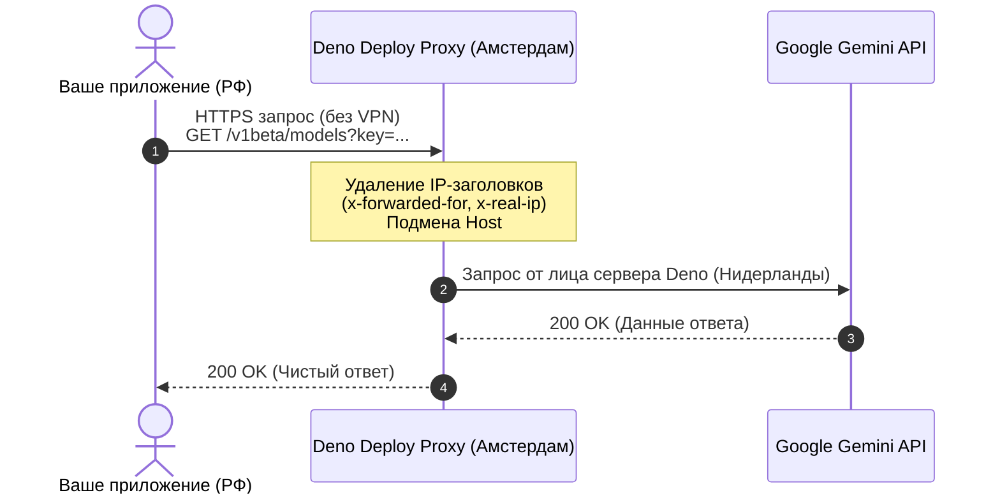

# ⚡ Доступ к Gemini API из РФ без VPN и затрат

<p align="center">
  
  
  
  
</p>

<p align="center">
  <b>Рабочий реверс-прокси на Deno Deploy для работы с Google Gemini API из России.</b><br>
  Автономное решение за 1 минуту: без СМС, без зарубежных карт и без головной боли.
</p>

---

## 📌 Содержание

- [📖 Предыстория](#-предыстория)
- [🧱 Хроника граблей](#-хроника-граблей)
  - [Грабли №1. Cloudflare Workers и «проклятие Гонконга»](#грабли-1-cloudflare-workers-и-проклятие-гонконга)
  - [Грабли №2. Vercel и стена из СМС](#грабли-2-vercel-и-стена-из-смс)
- [🏆 Финал: Deno Deploy — святой Грааль](#-финал-deno-deploy--святой-грааль)
- [🗺️ Архитектура запроса](#️-архитектура-запроса)
- [🚀 Пошаговая инструкция](#-пошаговая-инструкция)
  - [Шаг 1. Создание проекта](#шаг-1-создание-проекта-в-deno-deploy)
  - [Шаг 2. Код реверс-прокси](#шаг-2-код-прокси)
  - [Шаг 3. Проверка работоспособности](#шаг-3-проверка-работы)
- [💻 Примеры интеграции в код](#-примеры-интеграции-в-код)
  - [Python (google-genai)](#python-библиотека-google-genai)
  - [Node.js / TypeScript (Fetch)](#nodejs--typescript-native-fetch)
  - [cURL](#curl-проверка)
- [⚖️ Сравнение сервисов](#️-сравнение-платформ)
- [🔒 Безопасность и рекомендации](#-безопасность-и-советы)

---

## 📖 Предыстория

При разработке приложений часто требуется подключить Google Gemini API: получаешь ключ в [Google AI Studio](https://aistudio.google.com/), дергаешь эндпоинт и забираешь результат. 

Но при прямом обращении из РФ Google отсекает запросы:

```json
{
  "error": {
    "code": 400,
    "message": "User location is not supported for the API use.",
    "status": "FAILED_PRECONDITION"
  }
}
```

Платить за сторонние прокси, покупать зарубежные VPS или VPN с выделенным IP для пет-проектов не хотелось. Цель — **бесплатное, надёжное и автономное решение**, которое разворачивается за минуту и не требует постоянной поддержки.

---

## 🧱 Хроника граблей

### Грабли №1. Cloudflare Workers и «проклятие Гонконга»

Первая мысль любого разработчика — развернуть бесплатный Worker на Cloudflare:

```http
HTTP/1.1 400 Bad Request
CF-Ray: 8a1b2c3d4e5f-HKG

{
  "error": {
    "code": 400,
    "message": "User location is not supported for the API use.",
    "status": "FAILED_PRECONDITION"
  }
}
```

> [!WARNING]
> **В чём причина?**
> Обратите внимание на заголовок `CF-Ray: ...-HKG`. Бесплатный Cloudflare Worker маршрутизирует Anycast-трафик на ближайшую ноду. Для многих провайдеров из РФ трафик принудительно заворачивается в Гонконг (**HKG**), где Gemini API официально заблокирован. 
> На бесплатном тарифе зафиксировать регион исполнения (например, Франкфурт) нельзя. Даже удаление заголовков `cf-connecting-ip` и `x-real-ip` не спасает — Google видит исходящий IP самого дата-центра Cloudflare в Гонконге.

---

### Грабли №2. Vercel и стена из СМС

Следующий кандидат — **Vercel Edge Functions**, где можно жёстко выставить регион (например, `fra1` — Франкфурт).

> [!CAUTION]
> **Блокирующий фактор:**
> При регистрации или верификации аккаунта Vercel требует номер мобильного телефона. СМС на номера `+7` не приходят либо регистрация сразу отклоняется. Искать виртуальные сим-карты ради простого прокси — лишний оверхед.

---

## 🏆 Финал: Deno Deploy — святой Грааль

Решение пришло откуда не ждали — [Deno Deploy](https://deno.com/deploy).

| Преимущество | Описание |
| :--- | :--- |
| ⚡ **Мгновенный старт** | Вход через GitHub в 1 клик, никаких номеров телефонов и СМС |
| 🎁 **Щедрый Free Tier** | **100 000 запросов в день** бесплатно |
| 🌍 **Правильные регионы** | Исполнение запросов в Европе (Амстердам, Франкфурт и др.) |
| 🛠️ **Zero Configuration** | Код пишется и деплоится прямо в браузере за 30 секунд |

---

## 🗺️ Архитектура запроса



---

## 🚀 Пошаговая инструкция

### Шаг 1. Создание проекта в Deno Deploy

1. Перейдите в панель [dash.deno.com](https://dash.deno.com/).
2. Нажмите **Sign in with GitHub** и подтвердите вход.
3. Нажмите кнопку **New Project** и выберите режим **Playground**.

```
┌─────────────────────────────────────────────────────────────┐
│  [+] New Project  ─►  [ Playground ]                        │
└─────────────────────────────────────────────────────────────┘
```

---

### Шаг 2. Код прокси

Удалите весь стартовый шаблон в веб-редакторе и вставьте следующий скрипт:

```typescript
Deno.serve(async (req: Request) => {
  const url = new URL(req.url);

  // Формируем целевой URL Google API с сохранением пути и параметров (?key=...)
  const targetUrl = `https://generativelanguage.googleapis.com${url.pathname}${url.search}`;

  // Очищаем заголовки, раскрывающие оригинальный IP клиента
  const headers = new Headers(req.headers);
  headers.delete("x-forwarded-for");
  headers.delete("x-real-ip");
  headers.set("host", "generativelanguage.googleapis.com");

  // Проксируем запрос в Google API
  return await fetch(targetUrl, {
    method: req.method,
    headers: headers,
    body: req.body,
    redirect: "follow",
  });
});
```

Нажмите **Save & Deploy** в правом верхнем углу.

> [!NOTE]
> После публикации вы получите персональный домен вида:  
> `https://ваш-проект.deno.net` или `https://ваш-проект.deno.dev`.

---

### Шаг 3. Проверка работы

Откройте терминал (PowerShell / Bash / CMD) и отправьте тестовый запрос:

```bash
curl -i "https://ВАШ-ПРОЕКТ.deno.net/v1beta/models?key=ВАШ_GEMINI_API_KEY"
```

**Ожидаемый ответ:**

```http
HTTP/1.1 200 OK
content-type: application/json; charset=UTF-8
via: HTTP/1.1 ams.vultr.prod.deno-cluster.net

{
  "models": [
    {
      "name": "models/gemini-2.5-flash",
      "displayName": "Gemini 2.5 Flash",
      ...
    }
  ]
}
```

> [!TIP]
> Обратите внимание на заголовок `via: ... ams ...` — запрос прошёл через дата-центр в **Амстердаме (AMS)**. Для Google это легитимный европейский трафик.

---

## 💻 Примеры интеграции в код

### Python (библиотека `google-genai`)

Установка:
```bash
pip install google-genai
```

Код:
```python
from google import genai
from google.genai import types

# Инициализируем клиент, подменив базовый URL на наш Deno-прокси
client = genai.Client(
    api_key="ВАШ_GEMINI_API_KEY",
    http_options=types.HttpOptions(
        base_url="https://ВАШ-ПРОЕКТ.deno.net"
    )
)

response = client.models.generate_content(
    model="gemini-2.5-flash",
    contents="Привет! Расскажи короткий факт о космосе."
)

print(response.text)
```

---

### Node.js / TypeScript (Native Fetch)

```typescript
const GEMINI_API_KEY = "ВАШ_GEMINI_API_KEY";
const PROXY_HOST = "https://ВАШ-ПРОЕКТ.deno.net";

async function askGemini(prompt: string) {
  const url = `${PROXY_HOST}/v1beta/models/gemini-2.5-flash:generateContent?key=${GEMINI_API_KEY}`;
  
  const response = await fetch(url, {
    method: "POST",
    headers: {
      "Content-Type": "application/json",
    },
    body: JSON.stringify({
      contents: [
        {
          parts: [{ text: prompt }]
        }
      ]
    }),
  });

  const data = await response.json();
  console.log(data.candidates?.[0]?.content?.parts?.[0]?.text);
}

askGemini("Как дела?");
```

---

### cURL-проверка

```bash
curl -X POST "https://ВАШ-ПРОЕКТ.deno.net/v1beta/models/gemini-2.5-flash:generateContent?key=ВАШ_КЛЮЧ" \
  -H "Content-Type: application/json" \
  -d '{
    "contents": [{
      "parts": [{"text": "Объясни квантовую физику простыми словами в 2 предложениях"}]
    }]
  }'
```

---

## ⚖️ Сравнение платформ

| Параметр | Cloudflare Workers | Vercel Edge | Deno Deploy |
| :--- | :---: | :---: | :---: |
| **Регистрация из РФ** | Без проблем | Требует не-RU телефон | Через GitHub за 5 сек |
| **Локация бесплатной ноды** | Часто Гонконг (блокировка) | Настраиваемая | Европа (Нидерланды / Германия) |
| **Лимит бесплатного тарифа** | 100k запросов/день | 100k запросов/день | 100k запросов/день |
| **Работает с Gemini «из коробки»** | ❌ Нет | ⚠️ Сложно зарегистрироваться | ✅ **Да** |

---

## 🔒 Безопасность и советы

> [!IMPORTANT]
> **Не публикуйте свой Deno URL в открытых репозиториях без защиты!**
> Если кто-то узнает ваш URL Deno и Gemini API-ключ, он сможет тратить ваши лимиты.

1. **Храните ключи в переменных окружения (`.env`)**, а не в исходном коде.
2. **Добавьте секретный заголовок** (опционально): если хотите закрыть прокси от посторонних, добавьте в скрипт Deno проверку кастомного заголовка:
   ```typescript
   const secret = req.headers.get("x-proxy-secret");
   if (secret !== "МОЙ_СЕКРЕТНЫЙ_ТОКЕН") {
     return new Response("Unauthorized", { status: 401 });
   }
   ```
3. **Бесплатный лимит:** 100 000 вызовов в день с головой хватает для персональных ботов, пет-проектов и локальной разработки.

---

## 📄 Лицензия

MIT. Используйте свободно в своих проектах!
